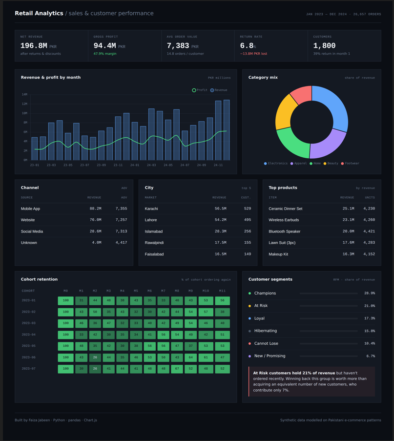

# Retail Analytics Dashboard

An interactive sales and customer-performance dashboard built from two years of e-commerce transaction data — 26,657 orders, 1,800 customers, PKR 197M in revenue.

Raw transactions in. Business decisions out.

### **[→ Open the live dashboard](https://faiza-jabeen.github.io/retail-analytics-dashboard/outputs/dashboard.html)**

*Fully interactive — hover any chart for detail.*



---

## The question this answers

Most sales dashboards report *what happened*. The harder and more useful question is *what should we do about it* — and that requires looking past headline revenue at the things that quietly decide whether a business grows or leaks.

Three findings came out of the analysis that would change how this business spends its money:

### 1. The most valuable customers are the ones walking out the door

RFM segmentation splits the customer base by how recently they bought, how often, and how much. The result:

| Segment | Customers | Share of revenue |
|---|---|---|
| Champions | 21.8% | **28.9%** |
| **At Risk** | **18.9%** | **21.0%** |
| Loyal | 19.2% | 17.3% |
| Hibernating | 21.7% | 15.8% |
| Cannot Lose | 8.8% | 10.4% |
| New / Promising | 9.6% | 6.7% |

**At Risk customers account for 21% of revenue and have stopped ordering.** New customers contribute under 7%.

The implication is uncomfortable for a marketing budget built around acquisition: a win-back campaign aimed at this one segment addresses three times the revenue that new-customer acquisition currently delivers. The cheapest customer to acquire is one you already had.

### 2. Returns cost more than discounts

PKR 13.8M lost to returns, against PKR 5.8M given away in discounts — and returns are worse than they look, because a returned order still incurs its cost of goods. Revenue goes to zero; the cost does not.

The dashboard therefore reports **realised revenue** (returns zeroed out, costs retained) rather than booked revenue. The two differ by enough to change which categories look healthy.

### 3. Retention stabilises rather than decays

Month-1 return rate is 39%, and by month 6 it is **43%** — it does not fall away. The customers who come back once tend to keep coming back. That makes the first repeat purchase the single highest-leverage moment in the customer lifecycle, and it is where retention effort belongs.

---

## What's in the dashboard

- **KPI strip** — net revenue, gross profit and margin, AOV, return rate, customer count
- **Revenue & profit trend** — monthly, with the Ramadan/Eid and winter wedding-season peaks visible
- **Category mix** — revenue share *and* margin, because a high-revenue low-margin category is not the same as a healthy one
- **Channel, city, product tables** — where the money actually comes from
- **Cohort retention heatmap** — every signup cohort tracked across 12 months
- **RFM segments** — customers grouped by behaviour, with revenue share per segment

Fully interactive: hover any chart for detail.

---

## The unglamorous part

The raw file is deliberately realistic, and roughly half the pipeline is cleaning:

| Problem | Why it mattered | Fix |
|---|---|---|
| `LAHORE`, `" Lahore"`, `Lahore` | Would have reported as three separate cities, splitting revenue three ways | Strip whitespace, title-case |
| 150 duplicate line items | Double-logged rows inflate revenue | Deduplicate |
| 25 rows with `quantity = 0` | An order line that sold nothing is not a sale; leaving it in drags down AOV | Drop |
| Missing `channel` on 2% of rows | Guessing would invent data | Label `Unknown` honestly |
| Returns | Booked revenue overstates reality | Compute realised revenue: revenue zeroed, COGS retained |

That last row is the one that matters most. It is a business-logic decision, not a data-cleaning one, and getting it wrong would make every downstream number optimistic.

---

## Running it

```bash
pip install -r requirements.txt

python data/make_data.py       # generate the raw dataset
python src/analysis.py         # clean, compute KPIs, cohorts, RFM
python src/build_dashboard.py  # render the dashboard

open outputs/dashboard.html
```

---

## Structure

```
├── data/
│   ├── make_data.py                 # dataset generator
│   ├── ecommerce_orders_raw.csv     # messy, as collected
│   └── ecommerce_orders_clean.csv   # analysis-ready
├── src/
│   ├── analysis.py                  # cleaning, KPIs, cohort, RFM
│   └── build_dashboard.py           # dashboard renderer
└── outputs/
    ├── dashboard.html               # the deliverable
    └── dashboard_data.json          # computed metrics
```

---

## Methods

| | |
|---|---|
| **Cleaning** | Deduplication, categorical normalisation, invalid-quantity removal, honest missing-value labelling |
| **Financial logic** | Gross → net → realised revenue; COGS retained on returns |
| **Cohort analysis** | Customers grouped by first-order month, tracked across 12 months; cohorts under 20 customers excluded as statistically meaningless |
| **Segmentation** | RFM quartile scoring (Recency reversed), mapped to six actionable segments |
| **Stack** | Python · pandas · Chart.js |

---

## A note on the data

The dataset is **synthetic**, generated to mirror real Pakistani e-commerce patterns: Ramadan and Eid demand spikes, the winter wedding season, monsoon lull, mobile-first channel mix, and the specific messiness transactional systems produce. This keeps the project fully reproducible.

The cleaning logic, financial definitions, cohort methodology and segmentation are exactly what I would apply to real transaction data. `data/make_data.py` documents how the data was built.

---

## About me

**Faiza Jabeen** — M.Phil Statistics, University of the Punjab. I turn messy data into things people can make decisions with.

📧 faizajabeenfuj1999@gmail.com
